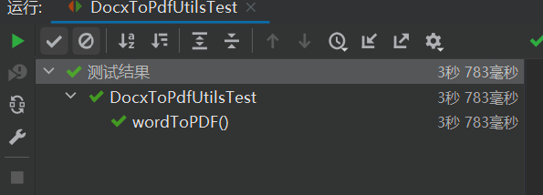
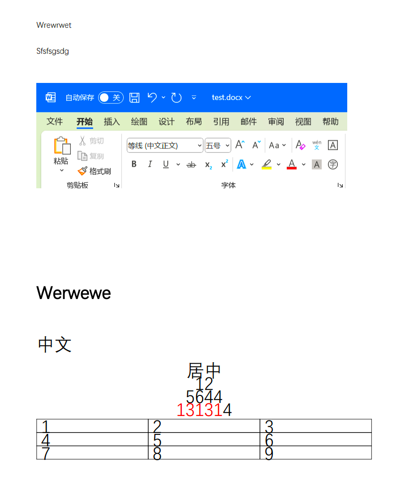

# poi实现

## 使用

创建springboot程序，pom文件如下：

```xml
<?xml version="1.0" encoding="UTF-8"?>
<project xmlns="http://maven.apache.org/POM/4.0.0" xmlns:xsi="http://www.w3.org/2001/XMLSchema-instance"
         xsi:schemaLocation="http://maven.apache.org/POM/4.0.0 https://maven.apache.org/xsd/maven-4.0.0.xsd">
    <modelVersion>4.0.0</modelVersion>
    <parent>
        <groupId>org.springframework.boot</groupId>
        <artifactId>spring-boot-starter-parent</artifactId>
        <version>2.7.1</version>
        <relativePath/> <!-- lookup parent from repository -->
    </parent>
    <groupId>mao</groupId>
    <artifactId>poi-word-to-pdf</artifactId>
    <version>0.0.1-SNAPSHOT</version>
    <name>poi-word-to-pdf</name>
    <description>poi-word-to-pdf</description>
    <properties>
        <java.version>17</java.version>
    </properties>
    <dependencies>

        <dependency>
            <groupId>org.springframework.boot</groupId>
            <artifactId>spring-boot-starter</artifactId>
        </dependency>

        <dependency>
            <groupId>org.springframework.boot</groupId>
            <artifactId>spring-boot-starter-test</artifactId>
            <scope>test</scope>
        </dependency>

        <dependency>
            <groupId>org.apache.poi</groupId>
            <artifactId>poi-ooxml</artifactId>
            <version>4.1.2</version>
        </dependency>
        <!-- Word转PDF操作依赖 -->
        <dependency>
            <groupId>fr.opensagres.xdocreport</groupId>
            <artifactId>fr.opensagres.poi.xwpf.converter.pdf-gae</artifactId>
            <version>2.0.2</version>
        </dependency>

    </dependencies>

    <build>
        <plugins>
            <plugin>
                <groupId>org.springframework.boot</groupId>
                <artifactId>spring-boot-maven-plugin</artifactId>
            </plugin>
        </plugins>
    </build>

</project>

```


编写转换工具类DocxToPdfUtils：

```java
package mao.poiwordtopdf.utils;


import fr.opensagres.poi.xwpf.converter.pdf.PdfConverter;
import fr.opensagres.poi.xwpf.converter.pdf.PdfOptions;
import org.apache.poi.xwpf.usermodel.XWPFDocument;
import java.io.*;


import java.io.*;

/**
 * Project name(项目名称)：poi-word-to-pdf
 * Package(包名): mao.poiwordtopdf.utils
 * Class(类名): DocxToPdfUtils
 * Author(作者）: mao
 * Author QQ：1296193245
 * GitHub：https://github.com/maomao124/
 * Date(创建日期)： 2023/11/25
 * Time(创建时间)： 19:26
 * Version(版本): 1.0
 * Description(描述)： 无
 */

public class DocxToPdfUtils
{
    /**
     * word转pdf
     *
     * @param wordPath word文件路径
     * @param pdfPath  pdf文件路径
     * @throws IOException ioexception
     */
    public static void wordToPDF(String wordPath, String pdfPath) throws IOException
    {
        XWPFDocument xwpfDocument = null;
        InputStream inputStream = null;
        OutputStream outputStream = null;
        try
        {
            inputStream = new FileInputStream(wordPath);
            xwpfDocument = new XWPFDocument(inputStream);
            PdfOptions pdfOptions = PdfOptions.create();
            outputStream = new FileOutputStream(pdfPath);
            PdfConverter.getInstance().convert(xwpfDocument, outputStream, pdfOptions);
        }
        finally
        {
            if (xwpfDocument != null)
            {
                xwpfDocument.close();
            }
            if (inputStream != null)
            {
                inputStream.close();
            }
            if (outputStream != null)
            {
                outputStream.close();
            }
        }
    }
}

```


编写测试类：

```java
package mao.poiwordtopdf.utils;

import org.junit.jupiter.api.Test;
import org.springframework.boot.test.context.SpringBootTest;

import java.io.IOException;

import static org.junit.jupiter.api.Assertions.*;

/**
 * Project name(项目名称)：poi-word-to-pdf
 * Package(包名): mao.poiwordtopdf.utils
 * Class(测试类名): DocxToPdfUtilsTest
 * Author(作者）: mao
 * Author QQ：1296193245
 * GitHub：https://github.com/maomao124/
 * Date(创建日期)： 2023/11/25
 * Time(创建时间)： 19:36
 * Version(版本): 1.0
 * Description(描述)： 测试类
 */

@SpringBootTest
class DocxToPdfUtilsTest
{

    @Test
    void wordToPDF() throws IOException
    {
        DocxToPdfUtils.wordToPDF("./test.docx", "test.pdf");
    }
}
```


还是那个docx文件，测试结果如下：






## 结论

效果不好，性能不好，不考虑


